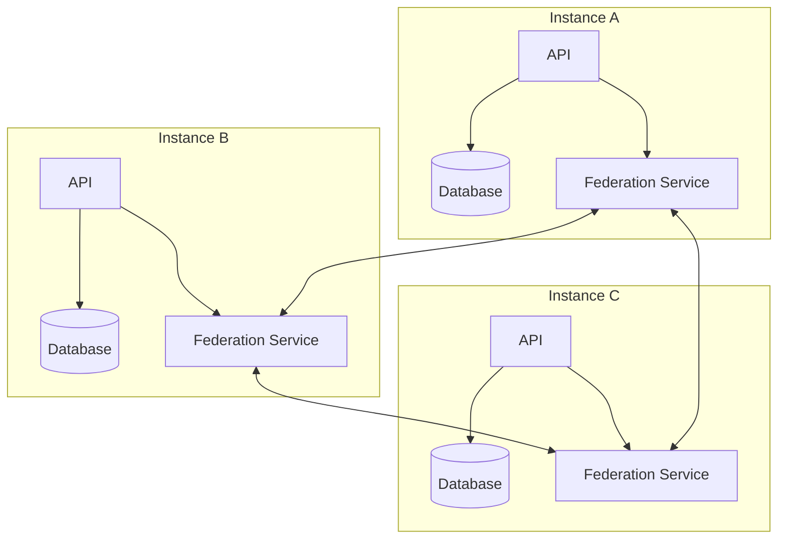
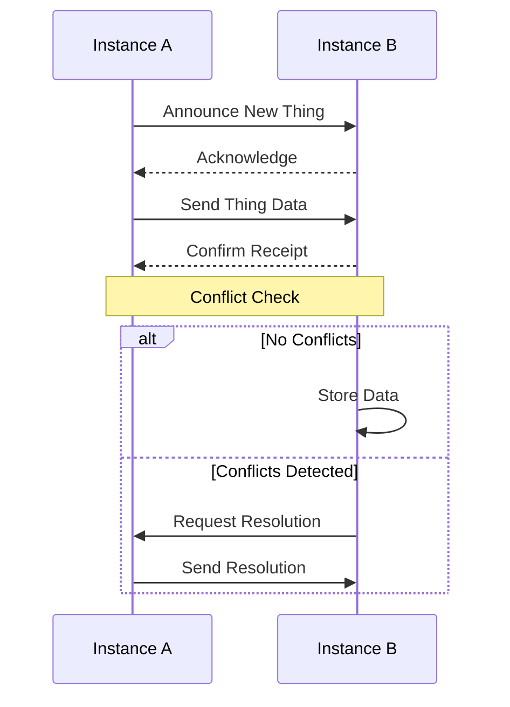
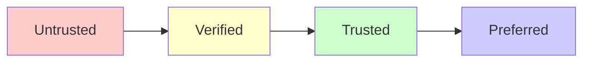
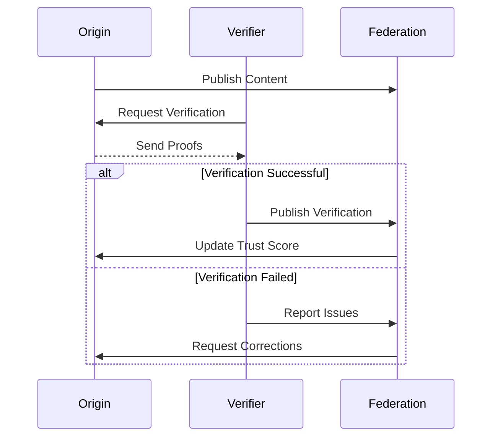

# ThingData Federation Protocol

## Documentation Overview
This documentation is part of a series:
- [Core API Documentation](README.md) - Basic concepts and operations
- [Advanced Operations](advanced-operations.md) - Conflict resolution and data management
- Current Document: Federation Protocol
- [Example Workflows](../workflows.md) - Including federation workflows

## Introduction

ThingData uses a federation protocol similar to ActivityPub to enable decentralized sharing of repair knowledge. Each ThingData instance can connect with others to share and synchronize data while maintaining local autonomy.

## Federation Architecture



## Instance Discovery

### WebFinger Protocol
ThingData instances can be discovered using WebFinger:

```http
GET /.well-known/webfinger?resource=thing:appliance/manufacturer/model
```

Response:
```json
{
  "subject": "thing:appliance/manufacturer/model",
  "links": [
    {
      "rel": "self",
      "href": "https://instance.example.com/things/123",
      "type": "application/activity+json"
    }
  ]
}
```

### Instance Registration
To connect instances:

```http
POST /api/v1/federation/connect
Content-Type: application/json

{
  "instance_uri": "https://instance.example.com",
  "public_key": "...",
  "capabilities": ["sync", "search", "verification"],
  "languages": ["en", "es", "de"]
}
```

## Data Synchronization

### Sync Process


### Sync API Endpoints

#### Announce New Content
```http
POST /api/v1/federation/announce
Content-Type: application/json

{
  "type": "thing|story|relationship",
  "uri": "thing:appliance/manufacturer/model",
  "timestamp": "2024-11-26T12:00:00Z",
  "signature": "..."
}
```

#### Request Content Sync
```http
POST /api/v1/federation/sync
Content-Type: application/json

{
  "uris": [
    "thing:appliance/manufacturer/model1",
    "thing:appliance/manufacturer/model2"
  ],
  "since": "2024-11-26T12:00:00Z"
}
```

## Trust and Verification

### Instance Trust Levels


### Content Verification Flow


## Example Usage

### Connect to Federation Network
```bash
# 1. Register your instance
curl -X POST http://localhost:8000/api/v1/federation/register \
-H "Content-Type: application/json" \
-d '{
  "instance_name": "RepairHub Berlin",
  "instance_uri": "https://repairhub-berlin.example.com",
  "description": "Repair knowledge hub in Berlin",
  "languages": ["en", "de"],
  "capabilities": ["sync", "search", "verification"]
}'

# 2. Connect to another instance
curl -X POST http://localhost:8000/api/v1/federation/connect \
-H "Content-Type: application/json" \
-d '{
  "instance_uri": "https://repaircafe-paris.example.com",
  "public_key": "..."
}'
```

### Share Content Across Instances
```bash
# Announce new repair story to federation
curl -X POST http://localhost:8000/api/v1/federation/announce \
-H "Content-Type: application/json" \
-d '{
  "type": "story",
  "uri": "story:1234",
  "summary": "Coffee machine pump replacement guide",
  "languages": ["en", "de"],
  "timestamp": "2024-11-26T12:00:00Z"
}'
```

## Security Considerations

### Authentication
- All federation requests must be signed using instance private keys
- Signatures follow the HTTP Signatures specification
- Instance public keys are exchanged during connection

### Authorization
- Instances can set policies for accepting content
- Content can be filtered based on trust levels
- Verification requirements can be configured

### Data Integrity
- All content includes cryptographic signatures
- Content history is tracked with Merkle trees
- Changes are versioned and auditable

## Related Documentation
- See [Advanced Operations](advanced-operations.md) for conflict resolution
- See [Example Workflows](../workflows.md) for practical examples
- See [Core API](README.md) for basic operations

Would you like me to:
1. Add more examples?
2. Add configuration documentation?
3. Add troubleshooting guides?
4. Create implementation guides?