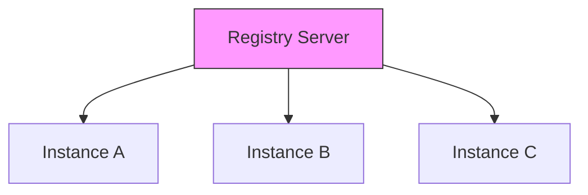
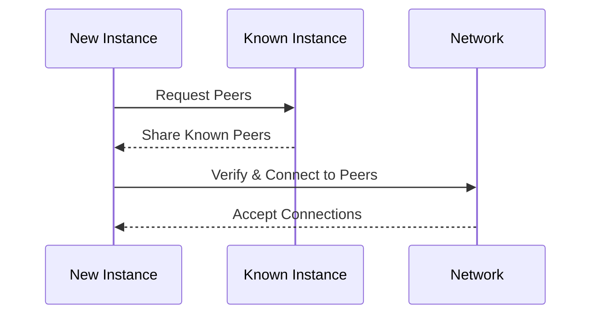
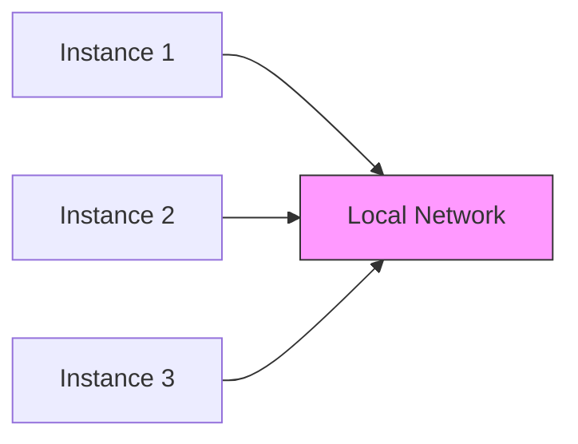
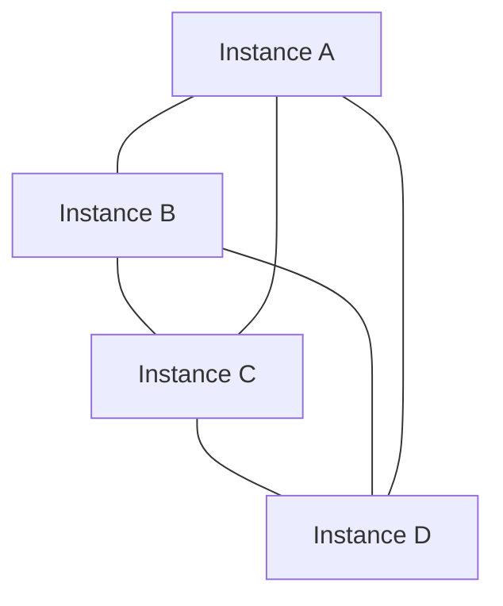
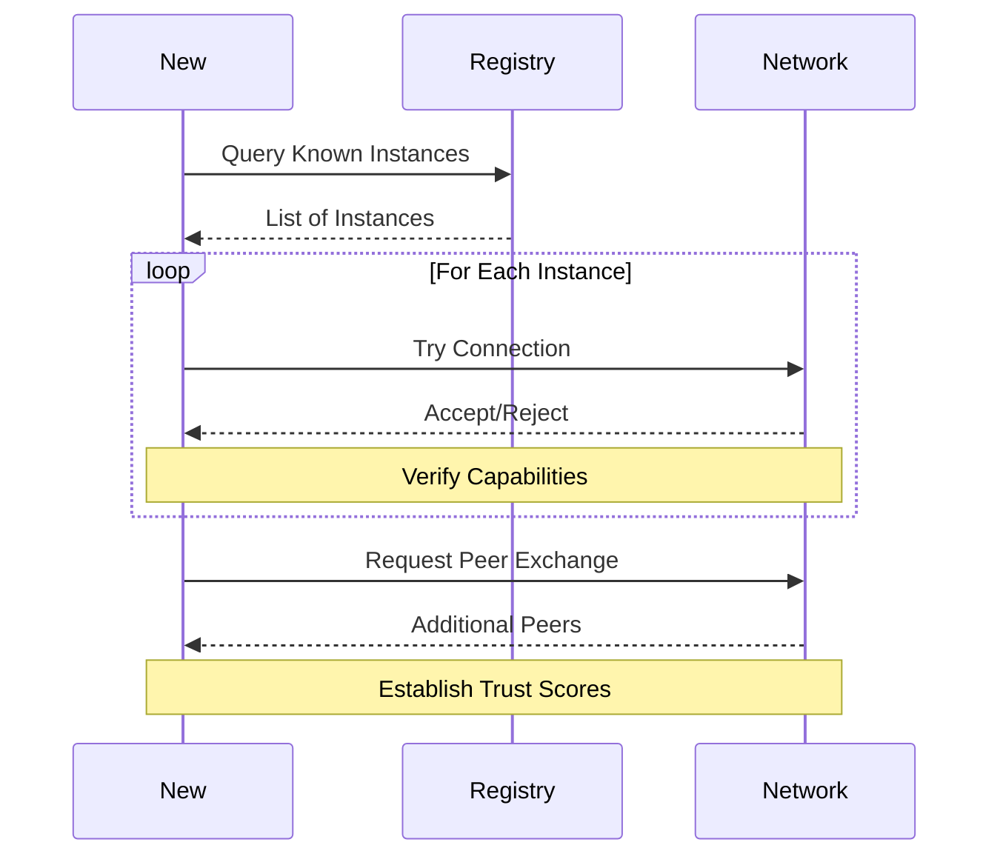

# ThingData Network Discovery

## Documentation Overview
- [Core API Documentation](README.md)
- [Federation Protocol](federation.md)
- Current Document: Network Discovery
- [Example Workflows](../workflows.md)

## Discovery Methods

### 1. Known Instances Registry


ThingData maintains a public registry of known instances:
```http
GET https://registry.thingdata.org/instances
```

Response:
```json
{
  "instances": [
    {
      "uri": "https://repairs.example.com",
      "name": "Community Repairs Hub",
      "location": "Berlin, Germany",
      "languages": ["de", "en"],
      "specializations": ["electronics", "appliances"],
      "trust_score": 0.95
    }
  ]
}
```

### 2. DNS-Based Discovery
ThingData instances can be discovered through DNS SRV records:

```bash
# Example DNS configuration
_thingdata._tcp.repaircafe-berlin.org. IN SRV 10 0 443 thingdata.repaircafe-berlin.org
```

Query for instances:
```bash
dig _thingdata._tcp.repaircafe-berlin.org SRV
```

### 3. Peer Exchange (PEX)



Request peers from a known instance:
```http
GET /api/v1/federation/peers
```

Response:
```json
{
  "peers": [
    {
      "uri": "https://instance1.example.com",
      "last_seen": "2024-11-26T12:00:00Z",
      "trust_score": 0.9,
      "capabilities": ["sync", "search"]
    }
  ]
}
```

### 4. Local Network Discovery

Using mDNS/Bonjour for local network discovery:


Service advertisement:
```yaml
service: _thingdata._tcp
domain: local
port: 443
txt-record:
  name: Repair Café Berlin
  version: 1.0.0
  capabilities: sync,search,verification
```

## Network Topology

### Mesh Network


Instances form a mesh network where:
- Each instance maintains connections to multiple peers
- No central authority is required
- Data can flow through multiple paths
- Network is resilient to node failures

### Instance Connection Flow



## Configuration

### Instance Advertisement
```yaml
# config/federation.yaml
discovery:
  # Registry configuration
  registry:
    enabled: true
    url: https://registry.thingdata.org
    auto_register: true
    
  # DNS configuration
  dns:
    enabled: true
    domain: repair-hub.org
    srv_record: _thingdata._tcp
    
  # Local network discovery
  mdns:
    enabled: true
    service_name: Repair Hub Berlin
    
  # Peer exchange
  pex:
    enabled: true
    max_peers: 50
    min_peers: 5
    peer_exchange_interval: 3600
```

## API Endpoints

### Register with Discovery Registry
```http
POST https://registry.thingdata.org/register
Content-Type: application/json

{
  "instance_uri": "https://repairs.example.com",
  "name": "Community Repairs Hub",
  "location": "Berlin, Germany",
  "languages": ["de", "en"],
  "specializations": ["electronics", "appliances"],
  "public_key": "...",
  "capabilities": ["sync", "search", "verification"]
}
```

### Query Local Network
```http
GET /api/v1/federation/discover/local
```

### Update Instance Information
```http
PUT /api/v1/federation/instance
Content-Type: application/json

{
  "name": "Community Repairs Hub",
  "description": "Community repair hub in Berlin",
  "capabilities": ["sync", "search", "verification"],
  "languages": ["de", "en"],
  "public": true
}
```

## Example: Starting a New Instance

1. Register with the discovery registry:
```bash
curl -X POST https://registry.thingdata.org/register \
-H "Content-Type: application/json" \
-d '{
  "instance_uri": "https://repairs.example.com",
  "name": "Community Repairs Hub",
  "location": "Berlin, Germany",
  "languages": ["de", "en"],
  "specializations": ["electronics", "appliances"]
}'
```

2. Query for existing instances:
```bash
curl -X GET "https://registry.thingdata.org/instances?location=Berlin&radius=50km"
```

3. Connect to discovered instances:
```bash
curl -X POST http://localhost:8000/api/v1/federation/connect \
-H "Content-Type: application/json" \
-d '{
  "instance_uri": "https://repaircafe-berlin.example.com",
  "capabilities": ["sync", "search"]
}'
```

4. Enable local network discovery:
```bash
curl -X PUT http://localhost:8000/api/v1/federation/discovery \
-H "Content-Type: application/json" \
-d '{
  "mdns_enabled": true,
  "service_name": "Repair Hub Berlin"
}'
```

## Related Documentation
- See [Federation Protocol](federation.md) for more details about instance communication
- See [Advanced Operations](advanced-operations.md) for managing federation relationships
- See [Example Workflows](../workflows.md) for practical federation examples
