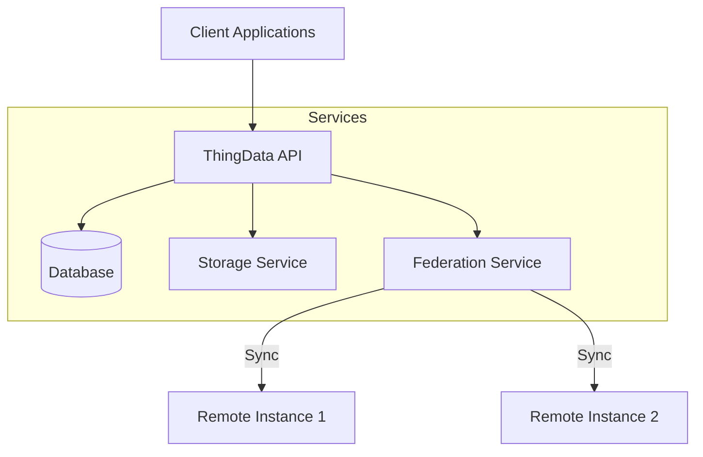
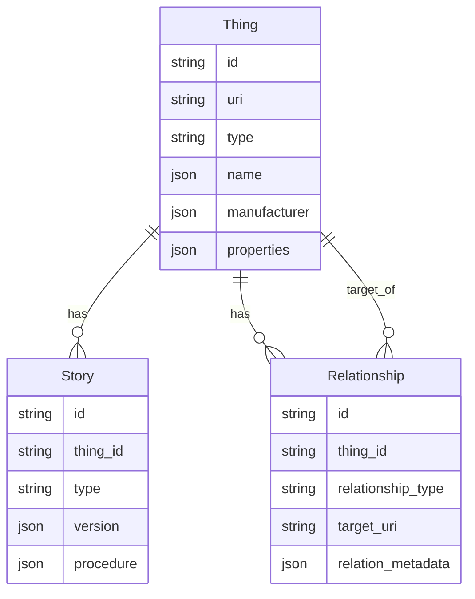
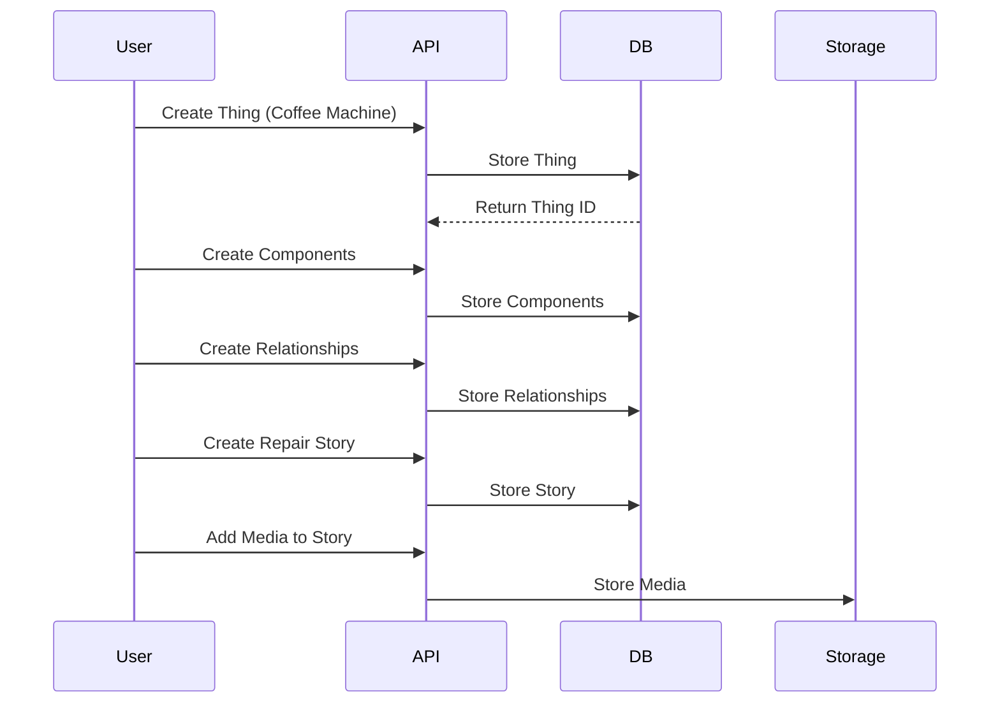
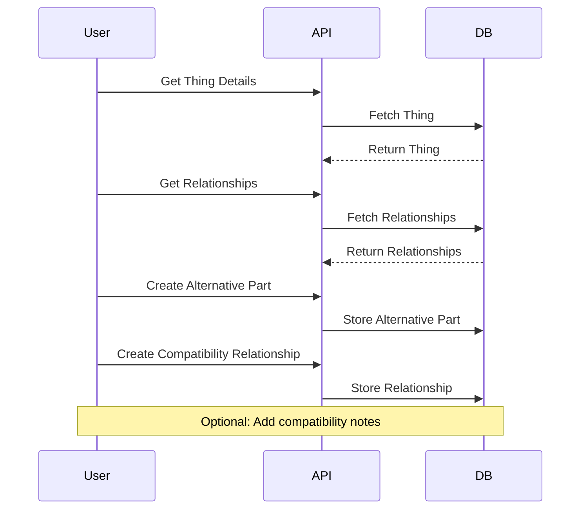

# ThingData Workflows and Examples

## Related Documentation
- [Core API Documentation](api/README.md)
- [Advanced Operations](api/advanced-operations.md)
- [Federation Protocol](api/federation.md)

## System Architecture



## Data Relationships



## Example Workflows

### 1. Documenting a Coffee Machine Repair



Example API calls for this workflow:

```bash
# 1. Create the coffee machine
curl -X POST http://localhost:8000/api/v1/things \
-H "Content-Type: application/json" \
-d '{
  "type": "appliance",
  "name": {
    "default": "Professional Coffee Machine XK-42",
    "translations": {
      "es": "Máquina de Café Profesional XK-42",
      "de": "Professionelle Kaffeemaschine XK-42"
    }
  },
  "manufacturer": {
    "name": "BaristaPlus",
    "website": "https://example.com",
    "contact": "support@example.com"
  },
  "properties": {
    "dimensions": {
      "length": 45.0,
      "width": 30.0,
      "height": 40.0
    },
    "materials": ["stainless steel", "plastic", "glass"],
    "serial_number": "XK42-2024-001"
  }
}'

# Store the returned ID
COFFEE_MACHINE_ID="returned_id_here"

# 2. Create pump component
curl -X POST http://localhost:8000/api/v1/things \
-H "Content-Type: application/json" \
-d '{
  "type": "component",
  "name": {
    "default": "Water Pump 15 Bar",
    "translations": {
      "es": "Bomba de Agua 15 Bar",
      "de": "Wasserpumpe 15 Bar"
    }
  },
  "manufacturer": {
    "name": "PumpTech",
    "website": "https://example.com"
  },
  "properties": {
    "materials": ["brass", "steel"],
    "serial_number": "PT-15B-001"
  }
}'

# Store the returned ID
PUMP_ID="returned_id_here"

# 3. Create relationship between machine and pump
curl -X POST http://localhost:8000/api/v1/relationships \
-H "Content-Type: application/json" \
-d '{
  "thing_id": "'$COFFEE_MACHINE_ID'",
  "relationship_type": "component",
  "target_uri": "thing:component/pumptech/waterpump-15bar",
  "relation_metadata": {
    "required": true,
    "quantity": 1,
    "position": "internal",
    "maintenance_interval": "12 months"
  }
}'

# 4. Create repair story
curl -X POST http://localhost:8000/api/v1/stories \
-H "Content-Type: application/json" \
-d '{
  "thing_id": "'$COFFEE_MACHINE_ID'",
  "type": "repair",
  "procedure": [
    {
      "order": 1,
      "description": {
        "default": "Disconnect power and water supply",
        "translations": {
          "es": "Desconecte la alimentación y el suministro de agua",
          "de": "Trennen Sie Strom- und Wasserversorgung"
        }
      },
      "warnings": ["Ensure machine is completely powered off",
                  "Wait 30 minutes for machine to cool down"],
      "tools": []
    },
    {
      "order": 2,
      "description": {
        "default": "Remove the side panel (6 screws)",
        "translations": {
          "es": "Quite el panel lateral (6 tornillos)",
          "de": "Entfernen Sie die Seitenverkleidung (6 Schrauben)"
        }
      },
      "tools": ["Phillips screwdriver PH2"]
    },
    {
      "order": 3,
      "description": {
        "default": "Replace the pump",
        "translations": {
          "es": "Reemplace la bomba",
          "de": "Ersetzen Sie die Pumpe"
        }
      },
      "tools": ["Adjustable wrench", "Pliers"],
      "warnings": ["Mark water line connections before disconnecting"]
    }
  ]
}'
```

### 2. Alternative Parts Workflow



Example for documenting alternative parts:

```bash
# 1. Create alternative pump
curl -X POST http://localhost:8000/api/v1/things \
-H "Content-Type: application/json" \
-d '{
  "type": "component",
  "name": {
    "default": "Universal Pump 16 Bar",
    "translations": {
      "es": "Bomba Universal 16 Bar",
      "de": "Universal-Pumpe 16 Bar"
    }
  },
  "manufacturer": {
    "name": "GenericPumps",
    "website": "https://example.com"
  },
  "properties": {
    "materials": ["brass", "steel"],
    "serial_number": "GP-16B-002"
  }
}'

# Store the returned ID
ALT_PUMP_ID="returned_id_here"

# 2. Create compatibility relationship
curl -X POST http://localhost:8000/api/v1/relationships \
-H "Content-Type: application/json" \
-d '{
  "thing_id": "'$PUMP_ID'",
  "relationship_type": "alternative",
  "target_uri": "thing:component/genericpumps/universal-16bar",
  "relation_metadata": {
    "compatibility": {
      "fully_compatible": true,
      "notes": "Slightly higher pressure (16 bar vs 15 bar)",
      "verified_by": "RepairCafe Berlin",
      "verification_date": "2024-01-15"
    }
  }
}'
```

## Federation Workflows
For detailed federation examples and workflows, see the [Federation Protocol Documentation](api/federation.md).
