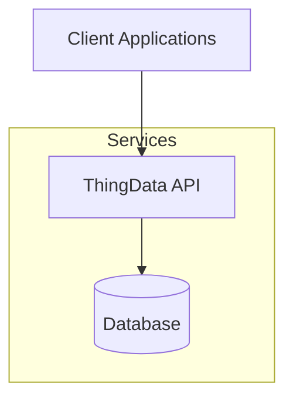
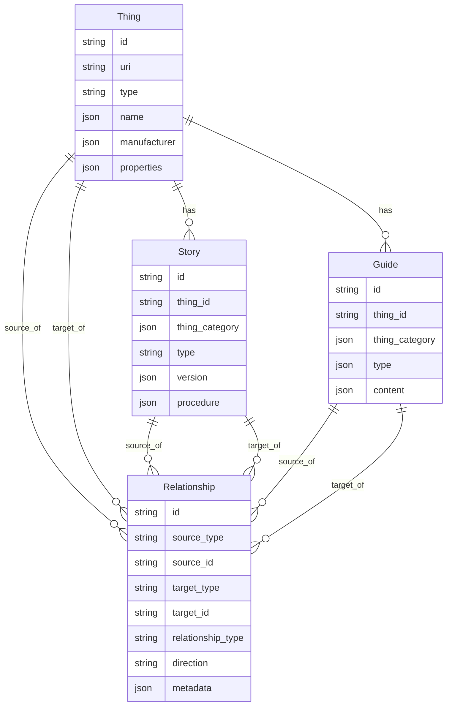
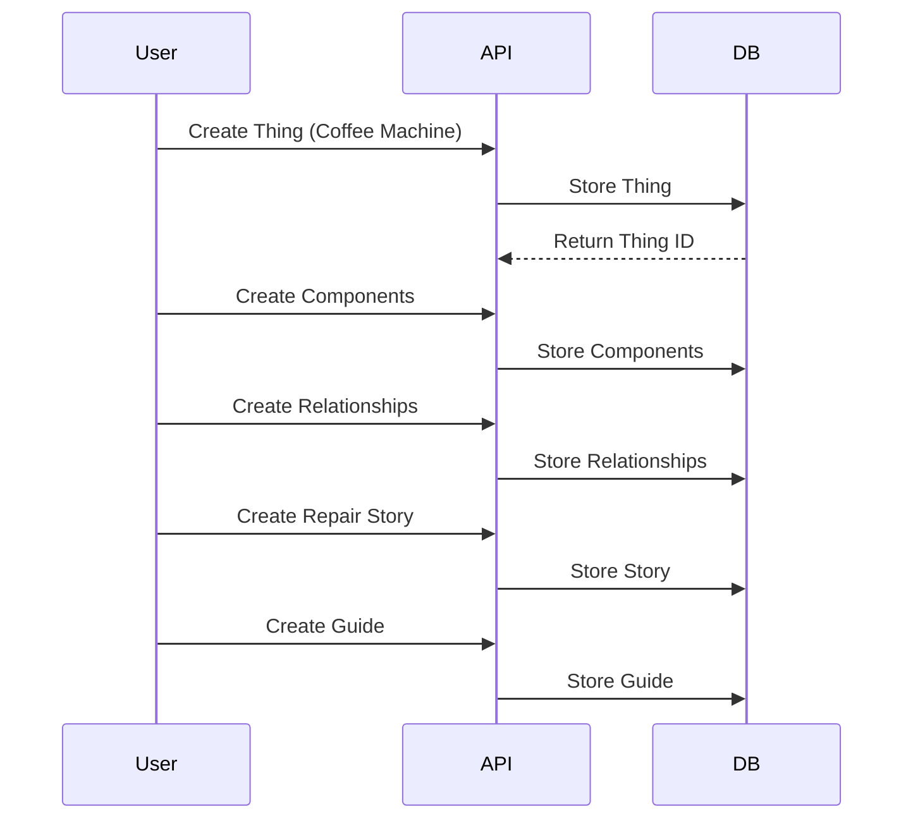
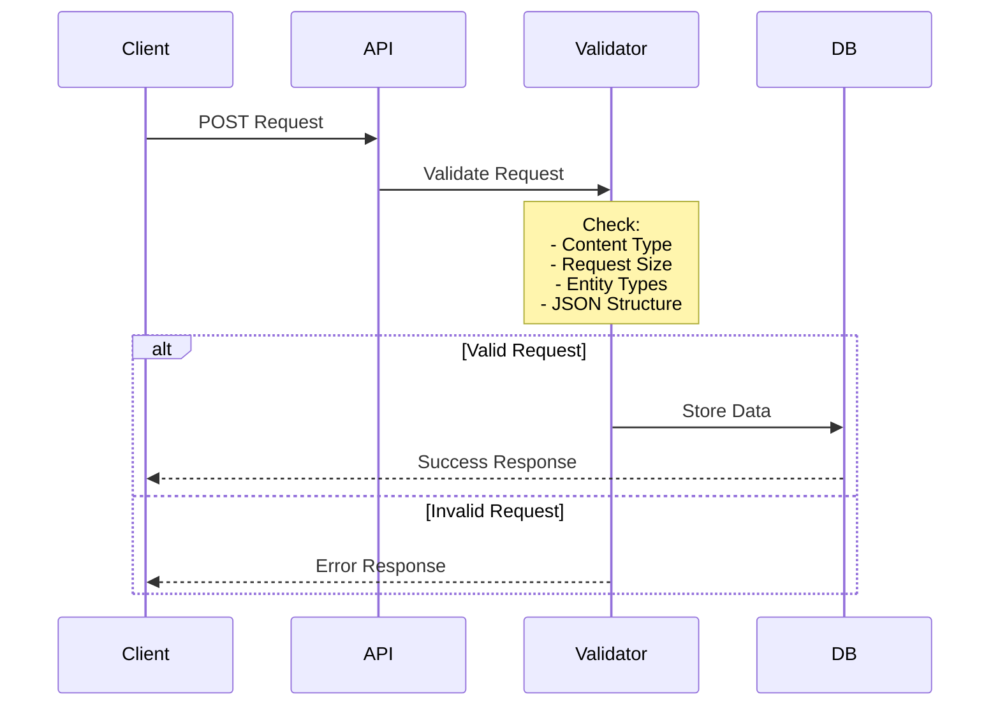

# ThingData Workflows and Examples

## Related Documentation
- [Core API Documentation](api/README.md)
- [Advanced Operations](api/advanced-operations.md)

## System Architecture



## Data Relationships



## Example Workflows

### 1. Documenting a Coffee Machine Repair



Example API calls for this workflow:

```bash
# 1. Create the coffee machine
curl -X POST http://localhost:8000/api/v1/things \
-H "Content-Type: application/json" \
-d '{
  "type": "appliance",
  "name": {
    "default": "Professional Coffee Machine XK-42",
    "translations": {
      "es": "Máquina de Café Profesional XK-42"
    }
  },
  "manufacturer": {
    "name": "BaristaPlus",
    "website": "https://example.com",
    "contact": "support@example.com"
  },
  "properties": {
    "dimensions": {
      "length": 45.0,
      "width": 30.0,
      "height": 40.0
    },
    "materials": ["stainless steel", "plastic", "glass"],
    "serial_number": "XK42-2024-001"
  }
}'

# Store the returned ID
export COFFEE_MACHINE_ID="returned_id_here"

# 2. Create pump component
curl -X POST http://localhost:8000/api/v1/things \
-H "Content-Type: application/json" \
-d '{
  "type": "component",
  "name": {
    "default": "Water Pump 15 Bar"
  },
  "manufacturer": {
    "name": "PumpTech"
  },
  "properties": {
    "materials": ["brass", "steel"],
    "serial_number": "PT-15B-001"
  }
}'

# Store the returned ID
export PUMP_ID="returned_id_here"

# 3. Create relationship between machine and pump
curl -X POST http://localhost:8000/api/v1/relationships \
-H "Content-Type: application/json" \
-d '{
  "source_type": "thing",
  "source_id": "'$COFFEE_MACHINE_ID'",
  "target_type": "thing",
  "target_id": "'$PUMP_ID'",
  "relationship_type": "has_component",
  "direction": "unidirectional",
  "metadata": {
    "position": "internal",
    "removable": true
  }
}'

# 4. Create repair guide
curl -X POST http://localhost:8000/api/v1/guides \
-H "Content-Type: application/json" \
-d '{
  "thing_id": "'$COFFEE_MACHINE_ID'",
  "type": {
    "primary": "repair",
    "secondary": "maintenance"
  },
  "content": {
    "title": {
      "default": "Pump Replacement Guide"
    },
    "summary": {
      "default": "How to replace the water pump"
    },
    "requirements": {
      "skills": ["Basic mechanics"],
      "tools": ["Screwdriver set"],
      "materials": ["Replacement pump"]
    },
    "warnings": [
      {
        "severity": "CAUTION",
        "message": {
          "default": "Disconnect power before servicing"
        }
      }
    ]
  }
}'
```

### 2. Development Workflows

#### Initial Setup

1. Start the server:
```bash
docker-compose up -d
```

2. Add sample data (optional):
```bash
./scripts/init_sample_data.sh
```

This creates:
- Sample laptop with components
- Repair guides
- Maintenance stories
- Various relationships

Perfect for:
- API exploration
- Integration testing
- UI development

## Security Best Practices

### Data Validation
1. Entity Types
   - Always use predefined types for entities
   - Validate type values before sending requests
   - Check documentation for allowed values

2. Request Size
   - Keep requests under 10MB
   - Split large content if necessary
   - Use appropriate compression for media

3. JSON Structure
   - Avoid deeply nested structures
   - Keep JSON depth under 20 levels
   - Use flat structures when possible

4. Content Types
   - Always set `Content-Type: application/json`
   - Validate JSON before sending
   - Check response content types

### Example: Secure Content Creation
